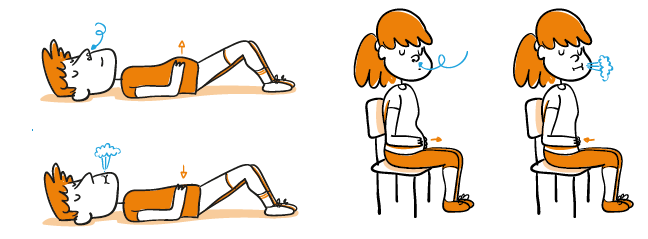
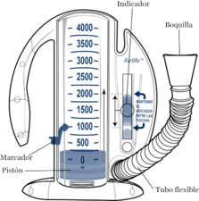
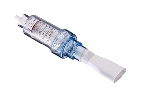

<h1>Rehabilitación Post-UCI</h1>

La rehabilitación post-UCI es un proceso integral que debe ser abarcado por un equipo multidisciplinario de profesionales, debido a que la experiencia que sufren los pacientes en una unidad de cuidados intensivos puede desencadenar en consecuencias neuromusculares, cardiorrespiratorias y psicológicas. Los tipos de terapias requeridas se pueden dividir en cognitiva, mental y física. Esta última además, puede subdividirse en tres tareas centrales para el fisioterapeuta que trata a un paciente con síndrome post-UCI, movilización (ejercicio físico), higiene bronquial y entrenamiento de la musculatura respiratoria, de los cuales se profundiza a continuación:

<h3>Tratamientos de Rehabilitación Física</h3>

En el intento de establecer prácticas orientadas al ejercicio físico en pacientes post-UCI, en aras a mejorar la movilidad y la recuperación de fuerza y resistencia de la musculatura motora, encontramos una variedad de intervenciones de distintos tipos como ejercicios de ciclismo de brazos y piernas, caminar y ejercicios de fortalecimiento, y estrategias como provisión de manuales y programas de autoayuda basados en departamentos de fisioterapia para pacientes ambulatorios que incluyen una combinación de ejercicios funcionales y de fortalecimiento y educación. Sin embargo, la calidad de la evidencia sobre la efectividad de dichos tratamientos, aún actualmente, es baja.[1][2][3]

Por otro lado, organizaciones de fisioterapia de distintos países recomiendan ciertos ejercicios físicos de rehabilitación de baja intensidad que han tenido buenos resultados durante los últimos años. Estas publicaciones confluyen en una rutina como la siguiente [4] :

▪ Ejercicios respiratorios: Respiraciones profundas antes del calentamiento.

▪ Ejercicios de calentamiento: ejercicios con la solicitación de los grandes grupos musculares que intervendrán en el desarrollo del entrenamiento: movilidad articular, marcha en el sitio, etc.

▪ Ejercicios de entrenamiento de resistencia-fuerza muscular.

- Frecuencia: 2-3 sesiones por semana.

- Intensidad: de cada ejercicio se harán 2-3 series. En cada serie se realizarán de 8 a 10 repeticiones de los principales grupos musculares incrementando la carga de trabajo, según la percepción del paciente y su evolución.

- Tiempo: 10-20 minutos.

- Tipo: para entrenamiento a domicilio, se pueden utilizar pesos libres, bandas    elásticas, botellas de agua, kilos de alimentos o el propio peso corporal. Se recomiendan ejercicios que sigan movimientos funcionales (por ejemplo; sentarse y levantarse de una silla, subir y bajar pesos a una altura parecida a un armario, etc).

▪ Ejercicios de entrenamiento de resistencia cardiorrespiratoria.

- Frecuencia: diaria.

- Intensidad: la recomendación general es realizar ejercicio de intensidad leve-moderada, al inicio e ir subiendo la intensidad a partir de la evolución del paciente.

- Tiempo: 10-30 minutos.

- Tipo: se recomiendan ejercicios que impliquen grandes grupos musculares como, por ejemplo, subir y bajar escaleras, caminar por casa, saltar en estático, correr en estático, bicicleta estática o caminadora.

▪ Ejercicios de vuelta a la calma: ejercicios de estiramiento, coordinación, equilibrio y relajación.

  

Figura 1. Respiración abdominal o diafragmática.

Fuente: Colegio de fisioterapeutas, Comunidad de Madrid.

Otro gran reto para los fisioterapeutas que asisten a los pacientes que sobreviven a una unidad de cuidados intensivos, principalmente los que requieren ventilación mecánica, es la rehabilitación respiratoria. Existen factores como, el tiempo de destete, el tiempo que permanecieron en UCI, las comorbilidades y la edad de los pacientes, que determinan el tiempo necesario de la terapia respiratoria.

La diversidad de ejercicios se relaciona con la variedad de patologías que sufre el sistema respiratorio. Por un lado, el atrofiamiento de la musculatura inspiratoria y espiratoria (diafragma y músculos accesorios), por otro, los cambios microestructurales que genera la PEEP en la UCI y, dependiendo de la enfermedad respiratoria, se puede ver afectada también la higiene bronquial.

En la fisioterapia respiratoria tampoco existe un tratamiento consensuado general, no obstante, en el marco de la pandemia de SARS CoV 2 múltiples asociaciones de fisioterapia, así como hospitales y colegios médicos han recomendado algunas técnicas destinadas a distintos objetivos como las mostradas a continuación [6] [7]:

 1. Optimizar el patrón respiratorio del paciente y disminuir su sensación de disnea cuando esté presente mediante:

   -Espiración labios fruncidos

   -Respiración diafragmática (sentado / acostado)

 2. Aumentar los volúmenes pulmonares y mejorar la expansión del parénquima pulmonar, favoreciendo al mismo tiempo la movilidad de la caja torácica mediante:

   -Respiración costal o expansión torácica (sentado / acostado)

   -Uso de un espirómetro/inspirómetro de incentivo (volumétrico): Dispositivo dependiente del flujo o del volumen de aire espirado, que actúa disminuyendo la presión pleural, promoviendo un aumento de la expansión pulmonar y mejor intercambio gaseoso. Además, actúa mediante retroalimentación visual, pues al realizar inspiraciones sostenidas máximas hay una representación visual del esfuerzo del paciente que lo motiva a seguir avanzando en su realización. [8]

  

Figura 2. Espirómetro de incentivo.

Fuente: Memorial Sloan Kettering Cancer Center.

 3. Favorecer el drenaje de secreciones mediante técnicas que puedan ser realizadas de forma autónoma y adaptada a las necesidades del paciente y a su capacidad de aprendizaje como [9]:

   -Espiración lenta con la boca abierta

   -Estimulación de la tos

   -Uso de un dispositivo de presión espiratoria positiva (Bottle PEP o Threshold): Dispositivo que mejora el volumen pulmonar, reduce la hiperinsuflación y elimina las secreciones. El dispositivo suministra una presión positiva controlada para fortalecer la fuerza y resistencia de la musculatura respiratoria. Cabe resaltar que existen alternativas domésticas como el Bottle PEP con eficacia comprobada. [10]

  

Figura 3. Dispositivo Threshold PEP.

Fuente: Health Conection.

<h3>Adherencia a la Rehabilitación</h3>

Con respecto a fisioterapia respiratoria, la literatura latinoamericana señala que los pacientes adultos mayores son más propensos a dejar el tratamiento y los principales motivos están relacionados con la motivación, la distancia de la vivienda al centro asistencial y la disponibilidad de ingreso económico o de obra social. [11] [12] [13]

<h2>Referencias</h2>

[1] C. L. Hodgson and C. J. Tipping, "Physiotherapy management of intensive care unit-acquired weakness," Journal of Physiotherapy, vol. 63, no. 1, pp. 4-10, 2017.

[2] B. Connolly, "Exercise rehabilitation following intensive care unit discharge for recovery from critical illness," Cochrane Database of Systematic Reviews, no. 6, 2015.

[3] Asociación Española de Fisioterapeutas en Atención Primaria y Salud Comunitaria, Recomendaciones para la atención fisioterápica a pacientes afectados por infección covid-19 desde atención primaria y comunitaria, Madrid, 2020.

[4] Hospital Nacional Hipólito Unanue, «Recomienda Ejercicios Respiratorios para Afectados por Covid-19,» 13 Julio 2020.

[5] Colegio Profesional de Fisioterapeutas de la Comunidad de Madrid, «Recomendaciones de fisioterapia respiratoria y ejercicio físico para personas afectadas por COVID19,» 27 Marzo 2020.

[6] S. S. G. C. e. a. Spruit MA, «An official American thoracic society/European respiratory society statement:,» American Journal of Respiratory and Critical Care Medicine, vol. 188, nº 8, 2013.

[7] B. M. H. L. e. a. Garvey C, «Pulmonary Rehabilitation Exercise Prescription in Chronic Obstructive,» Journal of Cardiopulmonary Rehabilitation, vol. 36, pp. 75-83, 2016.

[8] W. R. W. L. T. M. Restrepo RD, «Incentive Spirometry,» Respiratory Care, vol. 56, nº 10, pp. 1600-1604, 2011.

[9] J. M. y. M. V. (Coords.), «Técnicas manuales para el drenaje de,» Manual SEPAR de Procedimientos, nº 27, 2013.

[10] N. S. P. M. Liverani B, «An integrative review on the positive expiratory pressure (PEP)-bottle therapy for patients with pulmonary diseases,» Physiotherapy Research International, vol. 25, nº 1, p. 1823, 2020.

[11] V. e. a. Almadana Pacheco, «Perfil de pacientes que abandonan un programa de rehabilitación respiratoria,» vol. 53, nº 5, pp. 257-262, 2017.

[12] C. Boim, O. Caberlotto, M. Storni, M. Cortiñaz, F. Monti y M. Khoury, «ADHERENCIA A UN PROGRAMA INTERDISCIPLINARIO DE REHABILITACIÓN RESPIRATORIA,» MEDICINA (Buenos Aires), vol. 74, pp. 104-109, 2014.

[13] A. Mendez, P. Labra, R. Pizarro y N. Baeza, «Low rates of participation and completion of pulmonary rehabilitation in patients with chronic obstructive pulmonary disease in primary health care,» Revista Médica de Chile, vol. 146, nº 11, pp. 1304-1308, 2018.

